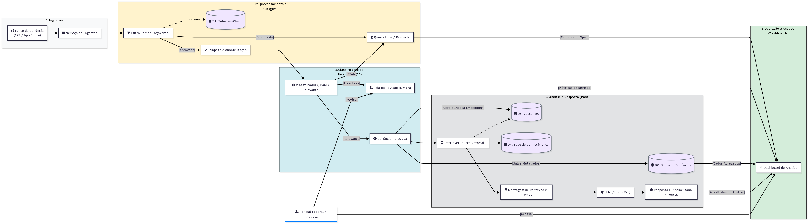
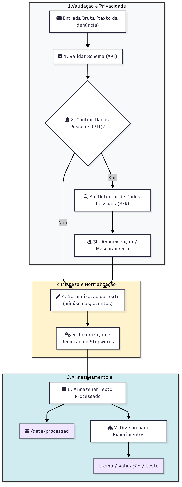
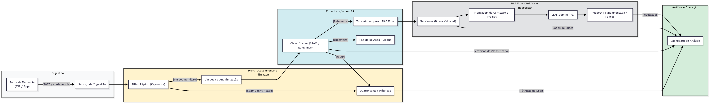
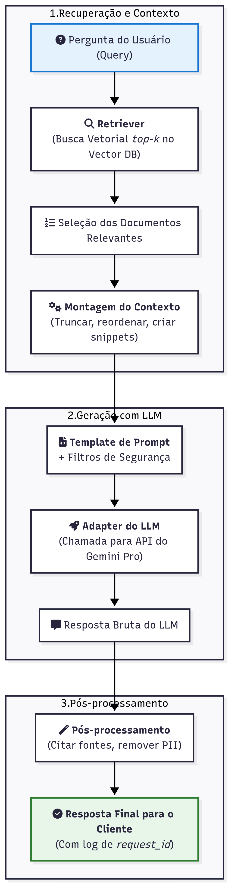
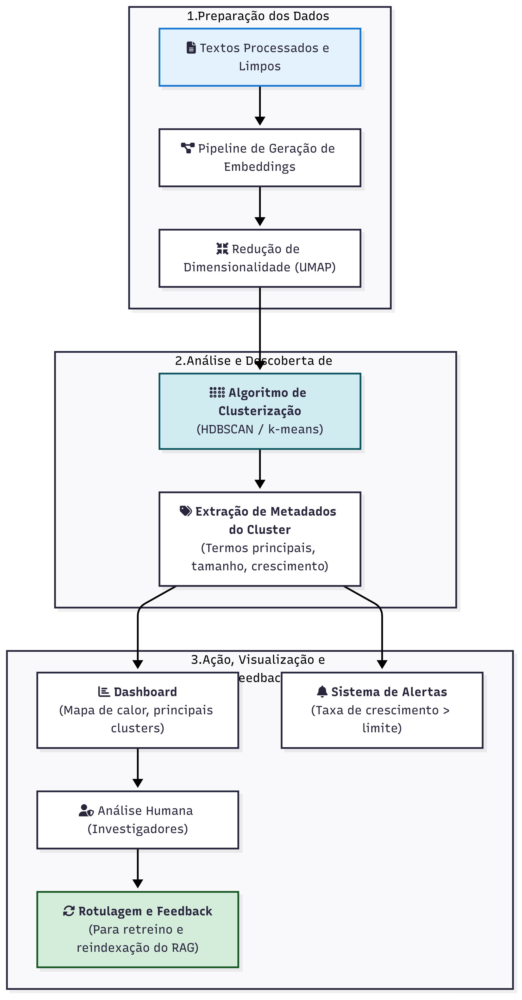
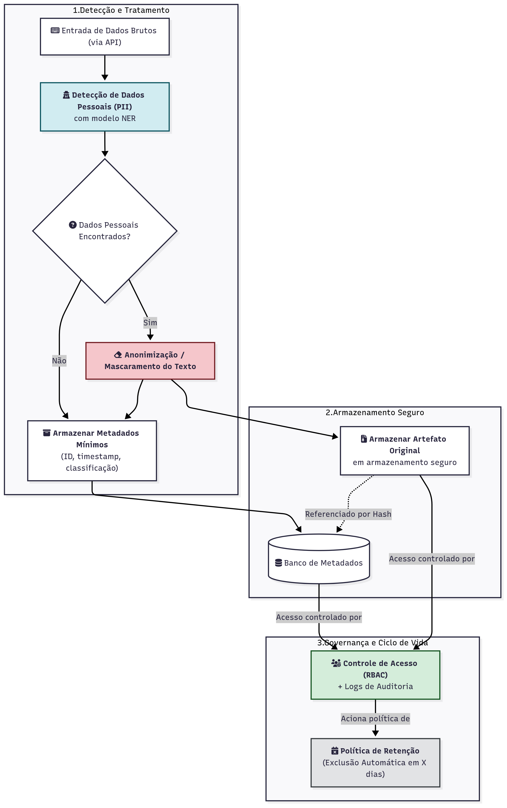

# Arquitetura de IA

Este documento centraliza todos os diagramas de fluxo de dados e processos da arquitetura de Inteligência Artificial do Apita Cidadão. O objetivo é fornecer uma referência visual clara para desenvolvedores, analistas e stakeholders.

## Como atualizar os diagramas

Recomendações rápidas para manter diagramas consistentes e auditáveis:

1. **Editar fonte**  
    - Editar o arquivo fonte `docs/diagramas/<nome>.mmd` (Mermaid) correspondente.

2. **Gerar imagem (Mermaid CLI)**  
    - Usar [Mermaid Chart](https://www.mermaidchart.com/) ou [Mermaid CLI](https://github.com/mermaid-js/mermaid-cli)
    - Exemplo com Mermaid CLI: `mmdc -i docs/diagramas/fluxo-de-dados-geral.mmd -o docs/diagramas/fluxo-de-dados-geral.png`

3. **Commitar ambos os arquivos (fonte + imagem)**  
    - Mensagem de commit sugerida:  
    
    ```
    docs(diagrams): update fluxo-de-dados-geral (mermaid + png)
    ```

4. **Abrir Pull Request**  
    - Título sugerido do PR: `docs(diagrams): atualizar <nome-diagrama> — motivo curto`  
    - No PR inclua: descrição da alteração, captura da imagem nova e menção ao líder se o diagrama impacta operação/privacidade.

5. **Revisão e merge**  
    - Para diagramas de impacto (privacidade, retenção, fluxo de dados), atribuir obrigatoriamente a revisão do PR ao líder de IA.

## Diagramas

### 1. Fluxo de Dados Geral da Plataforma

Este diagrama oferece uma visão completa e de alto nível do sistema, mostrando como as denúncias fluem desde a ingestão até a análise final e interação com o analista.



### 2. Pipeline de Pré-processamento de Texto

Este fluxo detalha as etapas de limpeza, validação, tratamento de privacidade e preparação dos textos das denúncias antes que possam ser utilizados pelos modelos de IA.



### 3. Fluxo de Classificação de Relevância

Este diagrama foca no pipeline de classificação em camadas, que decide se uma denúncia é spam, relevante ou se precisa de revisão humana.



### 4. Fluxo do Pipeline RAG (Busca & Resposta)

Este diagrama detalha o processo de como uma pergunta é transformada em uma resposta fundamentada usando a arquitetura RAG (Retrieval-Augmented Generation).



### 5. Pipeline Analítico de Clusterização

Este fluxo mostra como os textos são agrupados automaticamente para descobrir padrões (clusters), gerar alertas e alimentar dashboards para análise humana.



### 6. Fluxo de Privacidade e Retenção de Dados

Este fluxograma define o ciclo de vida de uma denúncia para garantir a conformidade com a LGPD, desde a detecção e tratamento de dados pessoais até a aplicação de políticas de retenção e exclusão.


